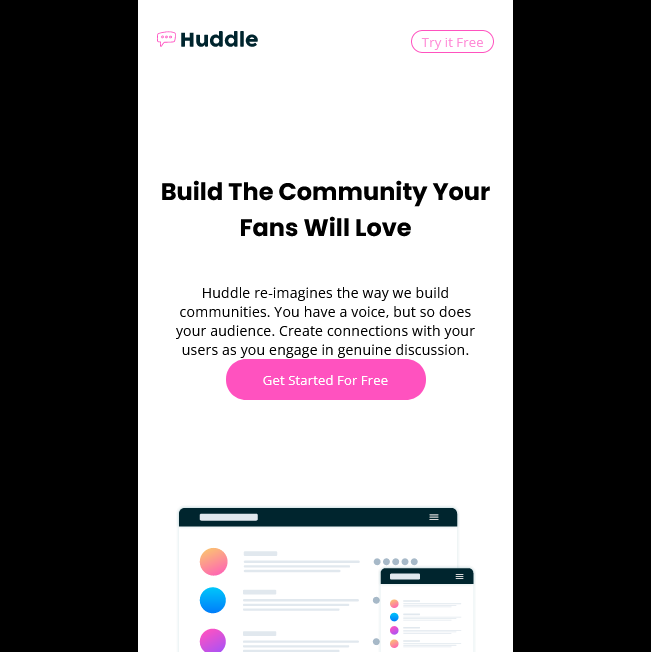

# Frontend Mentor - Huddle landing page with curved sections solution

This is a solution to the [Huddle landing page with curved sections challenge on Frontend Mentor](https://www.frontendmentor.io/challenges/huddle-landing-page-with-curved-sections-5ca5ecd01e82137ec91a50f2). Frontend Mentor challenges help you improve your coding skills by building realistic projects.

## Table of contents

-   [Overview](#overview)
    -   [The challenge](#the-challenge)
    -   [Screenshot](#screenshot)
    -   [Links](#links)
-   [My process](#my-process)
    -   [Built with](#built-with)
    -   [What I learned](#what-i-learned)
    -   [Continued development](#continued-development)
    -   [Useful resources](#useful-resources)
-   [Author](#author)
-   [Acknowledgments](#acknowledgments)

## Overview

This challenge was made using just HTML and CSS (Flexbox), an thinking in mobile first.

### The challenge

Users should be able to:

-   View the optimal layout for the site depending on their device's screen size
-   See hover states for all interactive elements on the page

### Screenshot




### Links

-   Solution URL: [Github repository](https://github.com/AndresRicardo/huddle-landing-page-with-curved-sections-master)
-   Live Site URL: [Github page](https://andresricardo.github.io/huddle-landing-page-with-curved-sections-master/)

## My process

Until now i am just learning web development, by now i just know html and css, not css frameworks, not css pre/post processores, not Javascript, not Js frameworks.

### Built with

-   Semantic HTML5 markup
-   CSS custom properties
-   Flexbox
-   Mobile-first workflow

### What I learned

doing this challenge i learned how set two or more background images to any element.

```css
#flowing {
    background: url(images/bg-section-bottom-mobile-1.svg) 0px 0px no-repeat, url(images/bg-section-top-mobile-2.svg)
            0px 100% no-repeat;
}
```

### Continued development

Even if to me is more complex design mobile first, i preffer to continue develop of this way.
By now in short time, my next skills to develop are css grid, css frameworks (boostrap or tailwind), css pre-preocessor (sass), css post-processors (postcss), pure Javascript, typescript and css-framework (angular).

### Useful resources

-   [Developer mozilla](https://developer.mozilla.org/es/docs/Web/CSS/) - This helped me like general reference.

## Author

-   Website - [Richi](https://github.com/AndresRicardo)
-   Frontend Mentor - [@AndresRicardo](https://www.frontendmentor.io/profile/AndresRicardo)

## Acknowledgments

To my mom and dad jajajajja.
